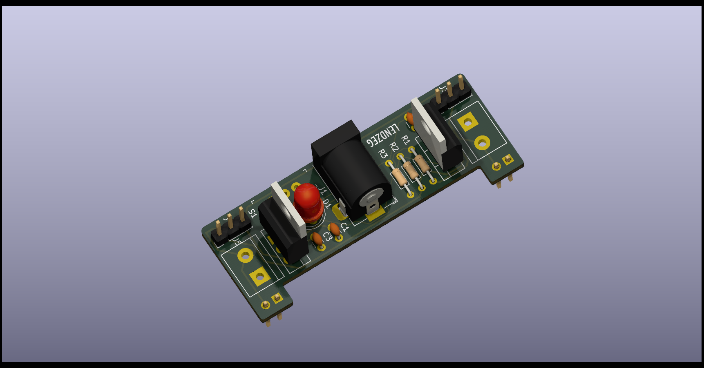
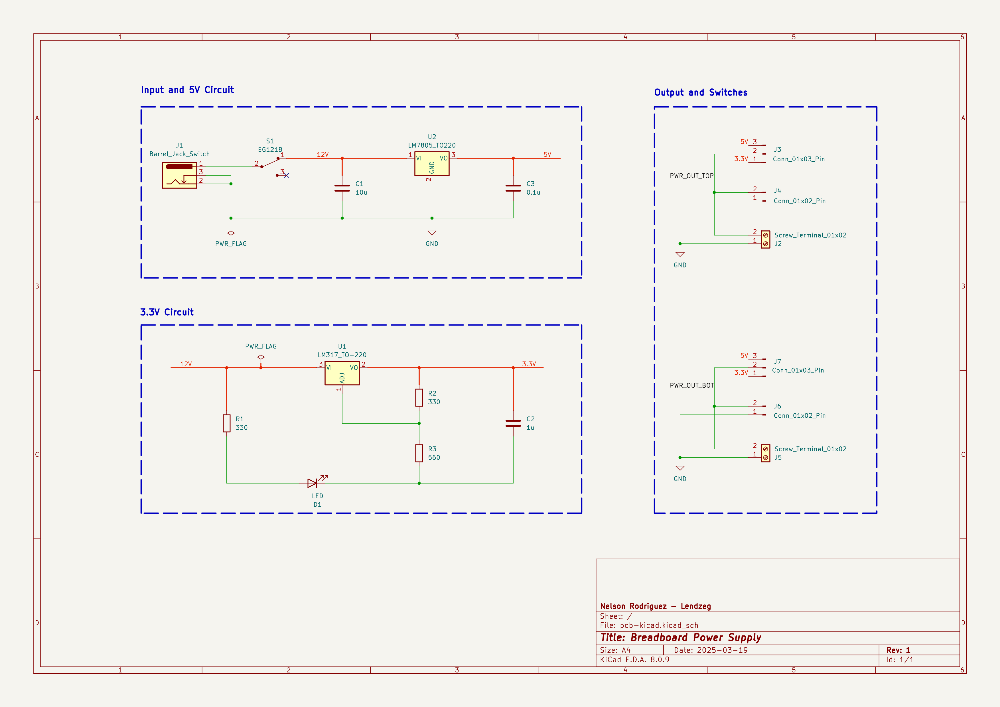

# Breadboard Power Supply


This project is a breadboard power supply designed using KiCad. It provides stable and adjustable voltage outputs for prototyping and testing circuits on a breadboard. The design includes components such as voltage regulators (LM317 and LM7805), capacitors, resistors, connectors, and more.



## Features
- **Dual Voltage Outputs**:
  - Adjustable output voltage using the LM317 regulator.
  - Fixed 5V output using the LM7805 regulator.
- **Barrel Jack Input**:
  - Accepts a standard DC barrel jack for power input.
- **Screw Terminals**:
  - Easy connection for input and output wires.
- **LED Indicator**:
  - Power-on LED to indicate when the supply is active.
- **Compact Design**:
  - Optimized for use with breadboards and prototyping.

---



---

## Components List
| Reference | Value       | Footprint                                                                 |
|-----------|-------------|---------------------------------------------------------------------------|
| C1        | 10u         | Capacitor_THT:C_Disc_D3.0mm_W1.6mm_P2.50mm                                |
| C2        | 1u          | Capacitor_THT:C_Disc_D3.0mm_W1.6mm_P2.50mm                                |
| C3        | 0.1u        | Capacitor_THT:C_Disc_D3.0mm_W1.6mm_P2.50mm                                |
| D1        | LED         | LED_THT:LED_D5.0mm                                                        |
| J1        | Barrel_Jack | Connector_BarrelJack:BarrelJack_Horizontal                                |
| J2, J5    | Screw_Terminal_01x02 | TerminalBlock:TerminalBlock_bornier-2_P5.08mm                             |
| J4, J6    | Conn_01x02_Male | Connector_PinHeader_2.54mm:PinHeader_1x02_P2.54mm_Vertical                |
| J3, J7    | Conn_01x03_Male | Connector_PinHeader_2.54mm:PinHeader_1x02_P2.54mm_Vertical                |
| R2        | 330         | Resistor_THT:R_Axial_DIN0204_L3.6mm_D1.6mm_P7.62mm_Horizontal             |
| R1, R3    | 560         | Resistor_THT:R_Axial_DIN0204_L3.6mm_D1.6mm_P7.62mm_Horizontal             |
| S1        | EG1218      | digikeyfootprints:Switch_Slide_11.6x4mm_EG1218                            |
| U1        | LM317_TO-220 | Package_TO_SOT_THT:TO-220-3_Vertical                                      |
| U2        | LM7805_TO220 | Package_TO_SOT_THT:TO-220-3_Vertical                                      |


## Schematic and PCB Design
The project is designed using **KiCad**, an open-source electronics design automation (EDA) suite. The repository includes:
- Schematic files (`.sch`)
- PCB layout files (`.kicad_pcb`)
- Component libraries and footprints.


## Getting Started

### Prerequisites
- KiCad (version 6.0 or later) installed on your system.
- Basic knowledge of PCB design and soldering.

### Steps to Use
1. Clone this repository to your local machine:
   ```bash
   git clone https://github.com/lendzeg/breadboard-power-supply.git
   ```
2. Open the KiCad project file (`breadboard-power-supply.pro`) in KiCad.
3. Review the schematic and PCB layout.
4. Generate Gerber files for manufacturing or modify the design as needed.
5. Assemble the components on the PCB as per the schematic.


## License
This project is licensed under the **MIT License**. Feel free to use, modify, and distribute the design for personal or commercial purposes.

## Contributing
Contributions are welcome! If you find any issues or have suggestions for improvement, please open an issue or submit a pull request.

---

Stay Curious - Stay Hack! 😎